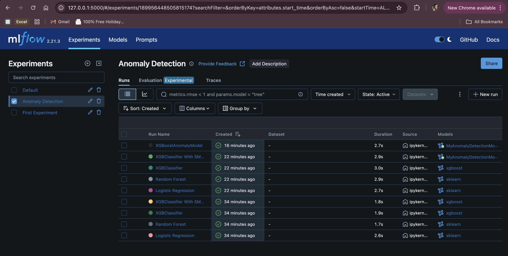
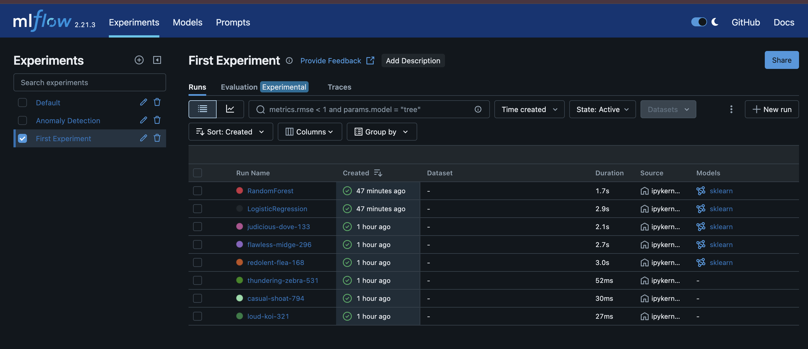
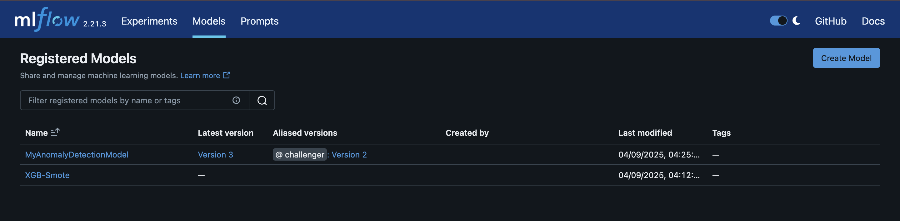
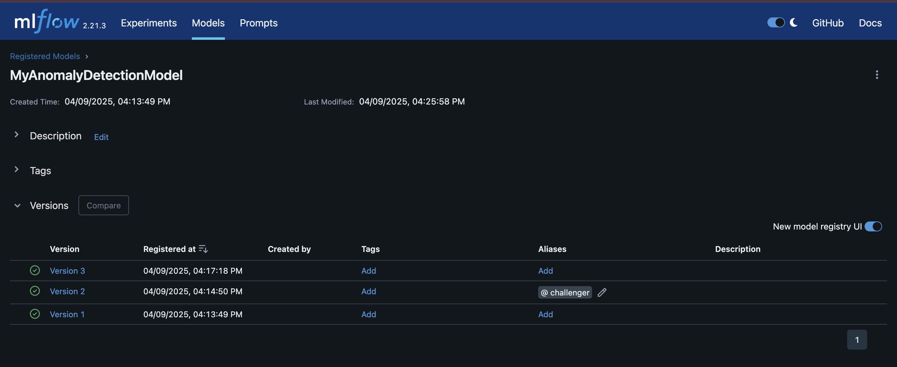
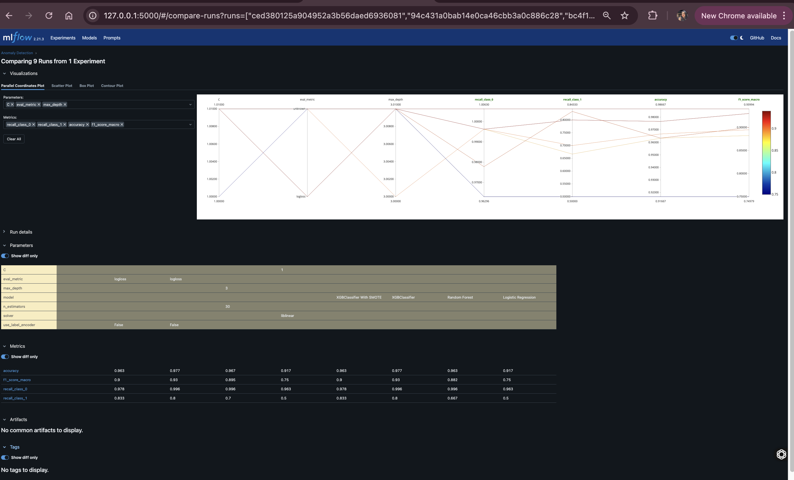

```markdown
🚀 MLflow Anomaly Detection Project

This project demonstrates a complete ML lifecycle using **MLflow** for an anomaly detection task. It includes model training, tracking, registry, versioning, and deployment support using `XGBoost`, `RandomForest`, and `LogisticRegression`.

---

🧠 What This Project Covers

- ✅ ML model training (XGBoost, RF, Logistic Regression)
- ✅ Handling class imbalance with SMOTETomek
- ✅ MLflow experiment tracking (metrics, parameters, artifacts)
- ✅ Model logging with input/output schema
- ✅ Model registry and aliasing (e.g., `@champion`, `@staging`)
- ✅ Model loading from registry using version or alias
- ✅ Run comparison and visualization using MLflow UI

---

📁 Project Structure

```
MLFlow/
├── first_experiment.ipynb
├── ml_flow_binary_classification.ipynb
├── ml_flow_dagshub.ipynb
├── ml_flow_model_management.ipynb
├── template.py
├── requirements.txt
├── screenshots/
│   ├── anomaly_runs.png
│   ├── comparison_plot.png
│   ├── first_experiment_runs.png
│   ├── model_registry.png
│   └── model_versions.png
└── README.md
```

---

🧪 Getting Started

 1. Clone the Repository

```bash
git clone https://github.com/ShivaniNatani/MlFlow.git
cd MlFlow
```

 2. Create Virtual Environment

```bash
python3 -m venv .venv
source .venv/bin/activate  # Windows: .venv\Scripts\activate
```

3. Install Dependencies

```bash
pip install -r requirements.txt
```

---

🚀 Launch MLflow UI

```bash
mlflow ui
```

Then visit: [http://127.0.0.1:5000](http://127.0.0.1:5000)

---

### 📸 MLflow UI Snapshots

---

### 🎰 Anomaly Detection Experiment  


---

### ✏️ First Experiment  


---

### 📦 Registered Models  


---

### 🧬 Model Versions and Aliases  


---

### 📊 MLflow Run Comparison  


---


---

### 🧰 Tech Stack

- 🐍 **Python**
- 🔁 **MLflow**
- 📘 **Scikit-learn**
- 🌲 **XGBoost**

---

### 👩‍💻 Author

**Shivani Natani**

- 🔗 [LinkedIn](https://www.linkedin.com/in/shivaninatani76/)
- 💻 [GitHub](https://github.com/ShivaniNatani)

---


---

 📜 License

This project is open source and free to use under the [MIT License](LICENSE).
```

---
